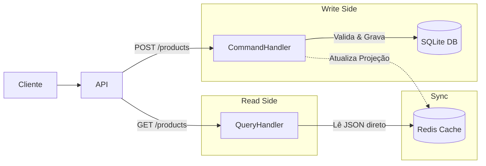

# Desafio Enterprise #05: CQRS (Command Query Responsibility Segregation)

## O Problema (Business Case)
Em sistemas de alta escala (e-commerce, redes sociais), a proporção de **Leitura** para **Escrita** é altamente assimétrica (ex: 1000 leituras para 1 escrita).
Tentar usar o mesmo modelo de dados (ex: Tabelas SQL Normalizadas em 3NF) para ambas as operações cria gargalos:
* **Escrita:** Precisa de transações ACID, constraints e integridade (Lento).
* **Leitura:** Precisa de velocidade e dados prontos para exibir (Rápido).

## A Solução Técnica
O padrão **CQRS** separa fisicamente ou logicamente os modelos:
1.  **Command Stack (Escrita):** Utiliza **SQLite** (simulando PostgreSQL/Oracle) para garantir integridade e regras de negócio complexas.
2.  **Query Stack (Leitura):** Utiliza **Redis** (NoSQL) para armazenar "Projeções" (Views) desnormalizadas dos dados, otimizadas para leitura imediata.

### Arquitetura do Desafio



## Tecnologias Utilizadas

    Python 3.10+ (FastAPI)

    SQLite: Banco Relacional (Write Model).

    Redis: Banco NoSQL Key-Value (Read Model).

    Pydantic: Validação de dados.

## Como Executar

1. Preparação do Ambiente

Certifique-se de ter o virtualenv ativo e as dependências instaladas.

```bash

# Na raiz do módulo
python3 -m venv env
source env/bin/activate
pip install -r requirements.txt

```

2. Infraestrutura (Redis)

## Suba o container do Redis para servir como modelo de leitura.
```bash

docker run -d -p 6379:6379 --name redis-cqrs redis:alpine
```

3. Rodar a Aplicação
```bash

make run
```
# A API estará disponível em http://localhost:8000

## Como Testar

Testes Manuais (cURL)

1. COMMAND: Criar Produto (Escrita)

```bash

curl -X POST http://localhost:8000/products \
  -H "Content-Type: application/json" \
  -d '{"sku": "GAMER-PC-01", "name": "PC Gamer Ultra", "price": 5000.00, "stock": 5}'
```

2. QUERY: Ler Produto (Leitura Rápida) Copie o ID retornado no passo anterior.

```bash

curl http://localhost:8000/products/SEU_ID_AQUI
```
3. QUERY: Listar Catálogo

```bash

curl http://localhost:8000/catalog
```
Testes Automatizados

Rodar a suíte de testes que valida a sincronia entre SQL e Redis.

```bash

pytest -v test_cqrs.py
```
